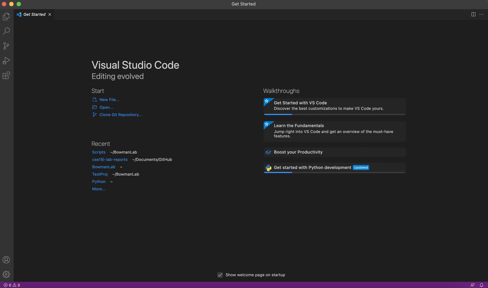
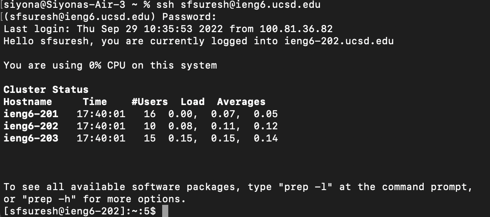
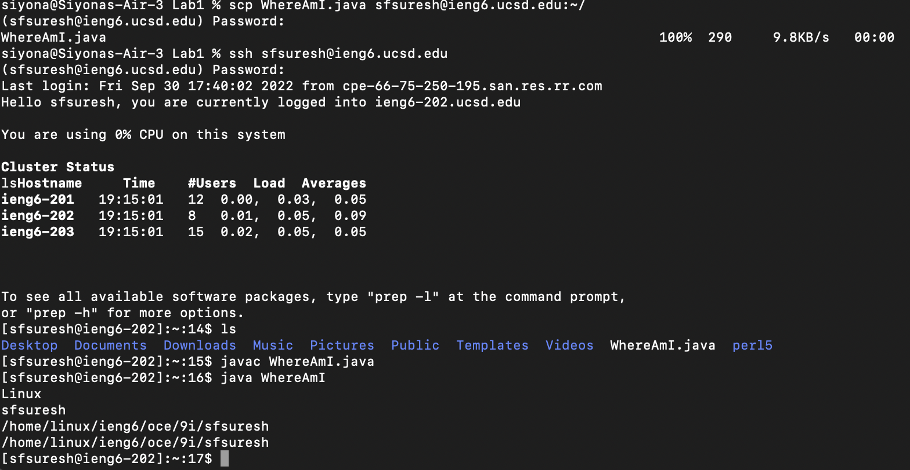

# Week 1 Lab Report 

In this lab report, I will be going through how to access a remote server from your computer. To preface, I reset my password for the cs15 specific account several times, but was never able to successfully ssh using it. For this lab, I used my active directory login instead to complete the tasks. 

The first step is to install VS Code on your laptop. I already had this downloaded from previous classes, however I can describe the steps needed to have VS Code operating on your computer. 
- go to the url [VS Code Link](https://code.visualstudio.com/)
- download the appropriate version for you depending on your OS
- once VS Code is installed and running, it should look something like this 
- 

The second step is to remotely connect to the server. 
- Open the terminal application
- Type out the ssh command, followed by your ieng account (cs15lfa22zz@ieng6.ucsd.edu), press enter
- Once this is done, it should ask for a password 
- Type in your password but make note that you will get no visual indication that your password has been typed
- press enter and you should now be on the remote server!
- 

Trying Commands
- there are several commands that can be used in the terminal
- some examples are cd, ls, pwd
- in the screenshot below, I used the commands cd, ls, and pwd on the remote server
- 

Moving Files with scp
- The scp command can be used to move files between computers. In this example I will move a file from my computer (client) to the ieng comouter (remote)
- First I used ^D to exit out of the server 
- Then I created a file on my computer called WhereAmI.java 
-  I ran the commands javac WhereAmI.java and java WhereAmI to get the following output
- 
- Then I ran the command scp WhereAmI.java sfsuresh@ieng6.ucsd.edu which prompted a password
- Then I sshed into the server again. Once you are in the server again and use the command ls, you should see the file there and should be able to run the file
- 

Setting an SSH key
- To set an SSH key means that you will be able to ssh and scp without entering your password
- First type in the command ssh-keygen and press enter whenever prompted (for file, password)
- Then ssh into your account 
- Once on the server, use the command mkdir .ssh
- Log out of the server and use the command scp /Users/siyona/.ssh/id_rsa.pub sfsuresh.ucsd.edu:~/.ssh/authorized_keys (replacing anything with the appropriate files)
- 

Optimize Remote Running
- There are several ways to optimize the commands that you type in to the terminal
- One example is using quotes containing a command after the ssh command to run those commands on the server (Ex: ssh sfsuresh@ieng6.ucsd.edu "pwd")
- 
- Another example is using semicolons to run several commands on one line (Ex: javac WhereAmI.java; java WhereAmI)
- 