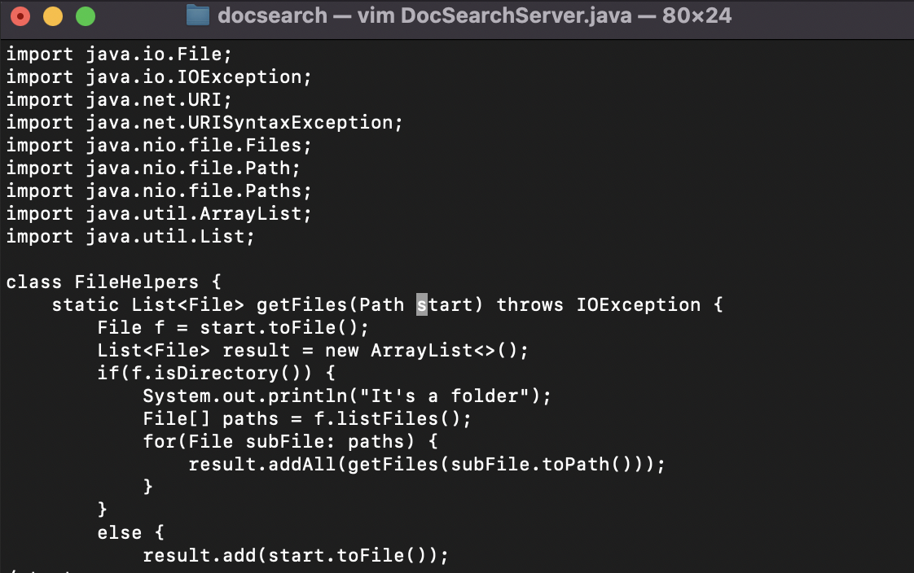
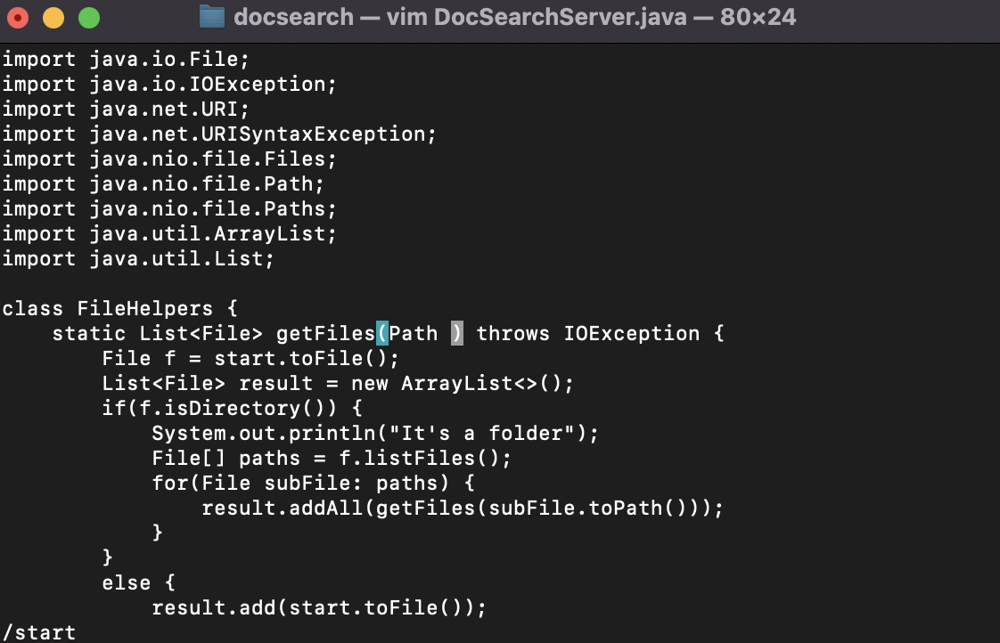
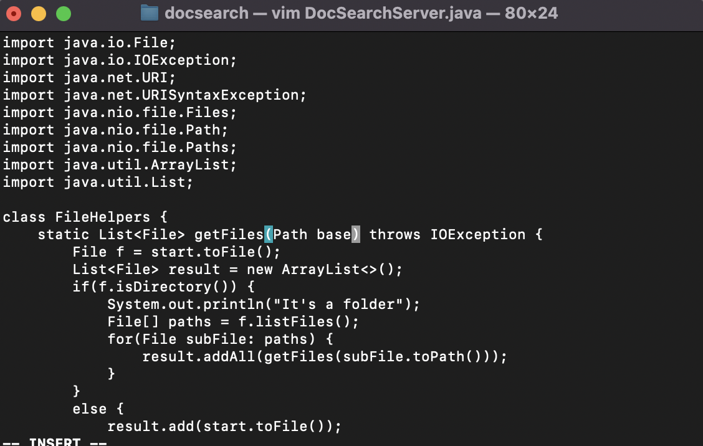
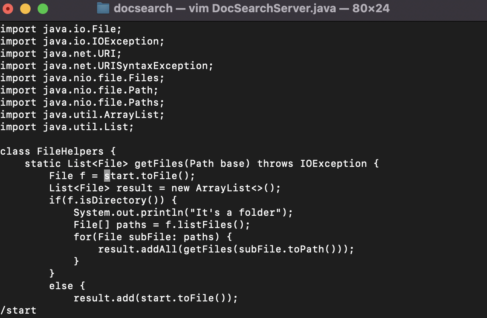
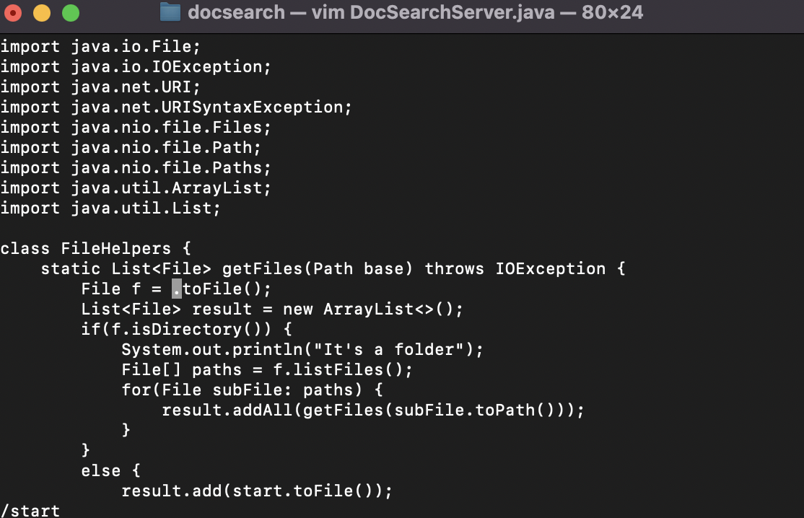
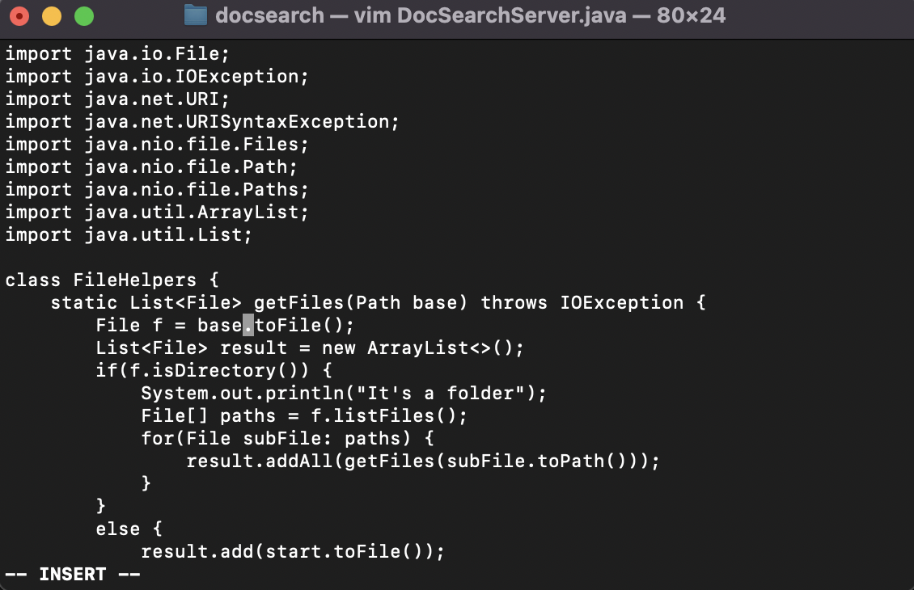
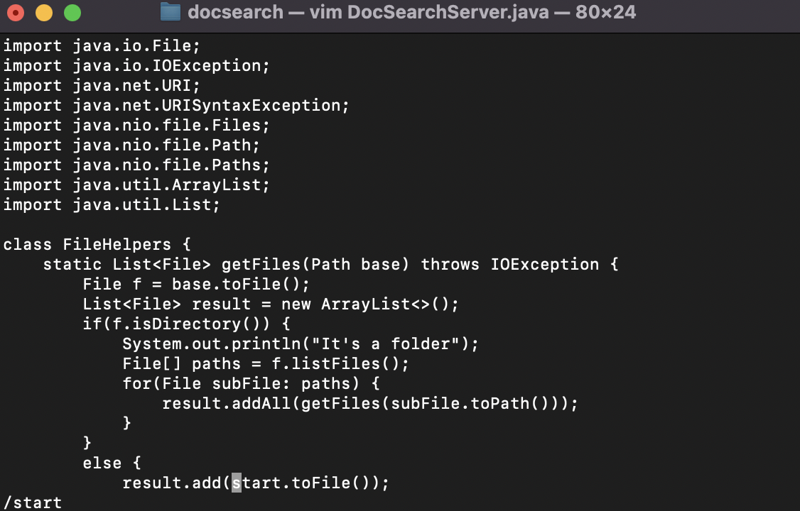
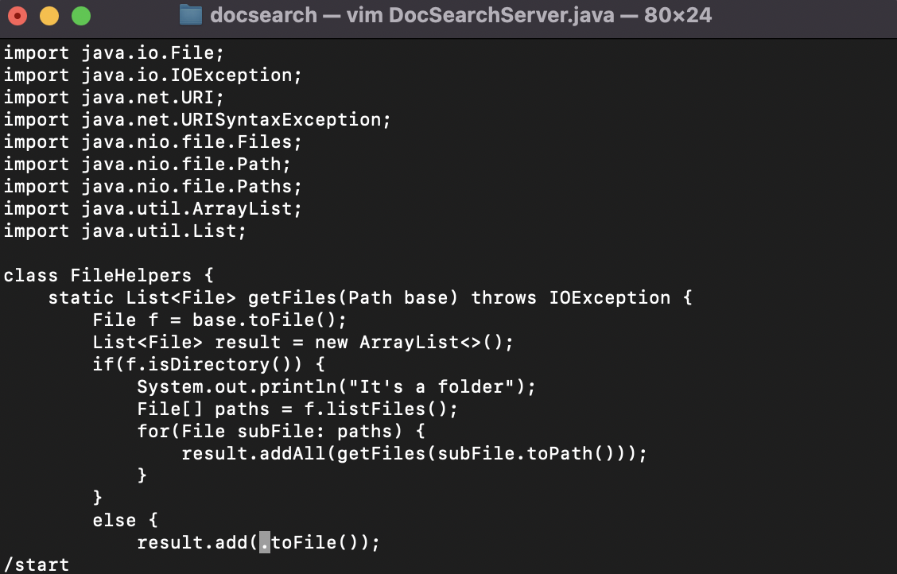
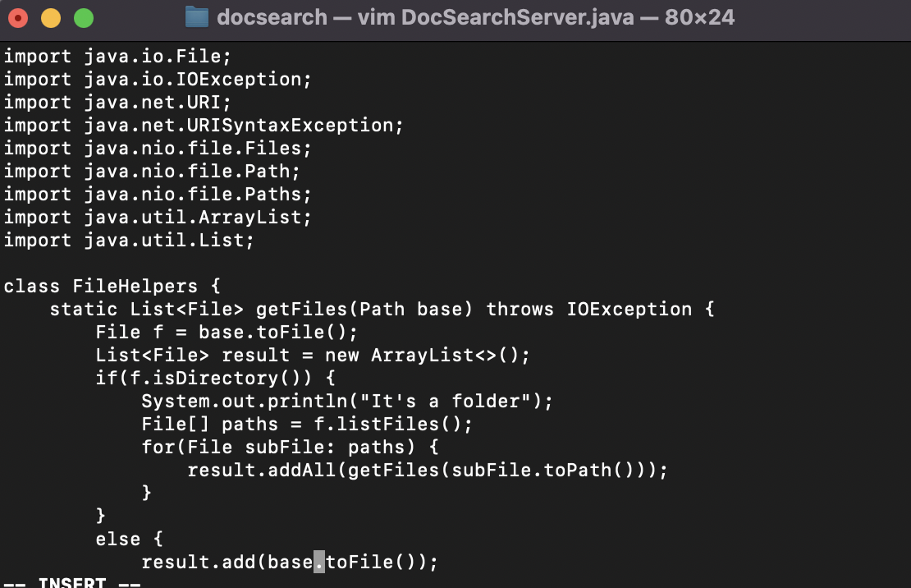
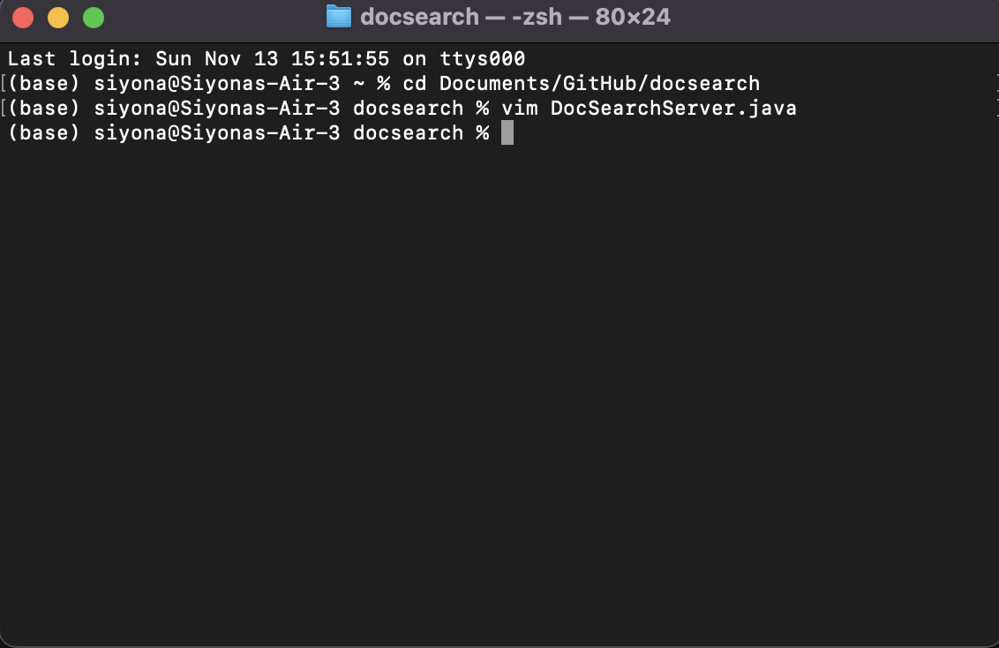

## Lab Report 4

# Part 1

The task that I picked is "changing the name of the start parameter and its uses to base". The sequence of vim commands that our group came up with to accomplish this task was: 
'''
vim D<Tab>S<Tab><Enter>/start<Enter>dwibase<Esc>ndwibase<Esc>ndwibase<Esc>:wq<Enter>
'''

I will break this sequence down to smaller sections and show what the process looks like on vim. 
- vim D<Tab>S<Tab><Enter>

- /start<Enter>

- dw

- ibase

- <Esc>n

- dw

- ibase 

- <Esc>

- dw

- ibase 

- <Esc>:wq

- <Enter>

