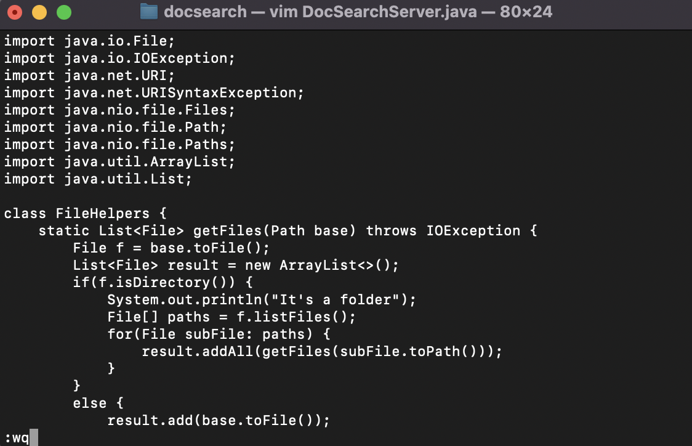

## Lab Report 4

# Part 1

The task that I picked is "changing the name of the start parameter and its uses to base". The sequence of vim commands that our group came up with to accomplish this task was: 
```
vim D(Tab)S(Tab)(Enter)/start(Enter)dwibase(Esc)ndwibase(Esc)ndwibase(Esc):wq(Enter)
```

I will break this sequence down to smaller sections and show what the process looks like on vim. 
- vim D(Tab)S(Tab)(Enter)

- /start(Enter)

- dw

- ibase

- (Esc)n

- dw

- ibase 

- (Esc)n

- dw

- ibase 

- (Esc):wq

- (Enter)


# Part 2

- Strategy 1: Start in Visual Studio Code and make the edit there, then scp the file to the remote server and run it there to confirm it works (you can just run bash test.sh on the remote to test it out). 

    This strategy took 45 seconds for me to execute. This strategy wasn't particularily difficult. If anything the only thing that was a bit tedious was making sure the scp and ssh commands were already pre-saved for easy access. 

- Strategy 2: Start already logged into a ssh session. Then, make the edit for the task you chose in Vim, then exit Vim and run bash test.sh.

    This strategy took 35 seconds for me to execute. This strategy was more difficult for me because I am still a little unfamiliar to vim. It took me a little longer to remember what keys to press but other than that, this strategy was very efficient because I did not have to ssh between servers. 

If I was working on a program that I was running remotely, I would definetely prefer to use vim. This is because I can imagine that with more practice using vim, it would take a significantly less amount of time to edit on vim rather than to edit on an IDE and then transfer it to the remote server. Also if any edits/changes needed to be made after I transferred it over to the remote server, it would be very tedious to keep repeating the scp & ssh process. 

However if the task was to be ran locally, I would still prefer to edit on an IDE. The time consuming part for me was ssh & scp so without having to do this, editing and running via Visual Studio Code is still faster and more familar to me. 
