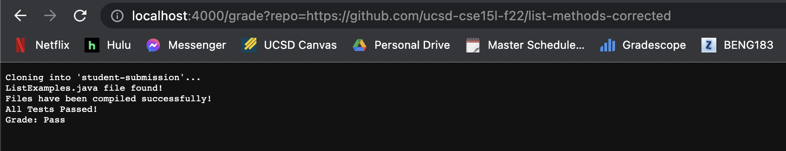
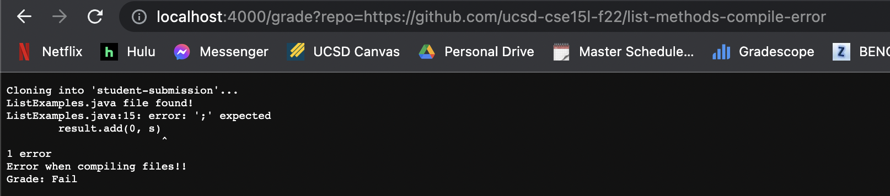
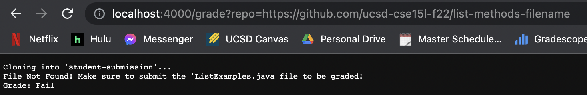

## Lab Report 5

# grade.sh script

```
set -e

rm -rf student-submission
mkdir student-submission
git clone $1 student-submission

cp TestListExamples.java student-submission
cd student-submission

CPATH=.:../lib/hamcrest-core-1.3.jar:../lib/junit-4.13.2.jar

if [[ -f ListExamples.java ]];
then 
    echo "ListExamples.java file found!"
else
    echo "File Not Found! Make sure to submit the 'ListExamples.java file to be graded!"
    echo "Grade: Fail"
    exit 1
fi

set +e

javac -cp $CPATH *.java

if [[ $? -eq 0 ]]
then
    echo "Files have been compiled successfully!"
else
    echo "Error when compiling files!!"
    echo "Grade: Fail"
    exit 2
fi

java -cp $CPATH org.junit.runner.JUnitCore TestListExamples > results.txt 

if [[ $? -eq 0 ]]
then
    echo "All Tests Passed!"
    echo "Grade: Pass"
    exit
else
    cat results.txt
    echo "are wrong!"
    echo "Grade: Fail"
    exit 3
fi
```

# Using grade.sh on three different student submisisons

First Submission: https://github.com/ucsd-cse15l-f22/list-methods-corrected, which has the methods corrected (I would expect this to get full or near-to-full credit)



Second Submission: https://github.com/ucsd-cse15l-f22/list-methods-compile-error, which has a syntax error of a missing semicolon. 



Third Submission: https://github.com/ucsd-cse15l-f22/list-methods-filename, which has a great implementation saved in a file with the wrong name.



# Tracing grade.sh

"set -e" 
- standard output: empty
- standard error: empty
- return code: 0

"rm -rf student-submission"
- standard output: empty
- standard error: empty
- return code: 0

"mkdir student-submission"
- standard output: empty
- standard error: empty
- return code: 0

"git clone $1 student-submission"
- standard output: empty
- standard error: Cloning into 'student-submission'...
- return code: 0

"cp TestListExamples.java student-submission"
- standard output: empty
- standard error: empty
- return code: 0

"cd student-submission"
- standard output: empty
- standard error: empty
- return code: 0

"if [[ -f ListExamples.java ]];"
- condition if false because the implementation is not saved in ListExamples.java, its saved in a file with a different name 

"then echo "ListExamples.java file found!""
- does not run because if statement returned false

"echo "File Not Found! Make sure to submit the ListExamples.java file to be graded!""
- standard output: File Not Found! Make sure to submit the ListExamples.java file to be graded
- standard error: empty
- return code: 0

"echo "Grade: Fail""
- standard output: Grade: Fail
- standard error: empty
- return code: 0

"exit 1"
- standard output: empty
- standard error: empty
- return code: 0

EVERYTHING AFTER THIS POINT DOES NOT RUN BECAUSE OF EARLY EXIT.

"set +e" 
- standard output: empty
- standard error: empty
- return code: 0

"javac -cp $CPATH *.java"
- standard output: empty
- standard error: empty
- return code: 0

"if [[ $? -eq 0 ]]"
- does not enter because of early exit

"java -cp $CPATH org.junit.runner.JUnitCore TestListExamples"
- standard output: 
JUnit version 4.13.2
..
Time: 0.063

OK (2 tests)
- standard error: empty
- return code: 0

"if [[ $? -eq 0 ]]"
- does not enter because of early exit


